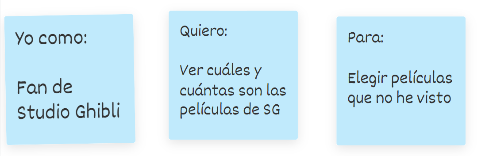
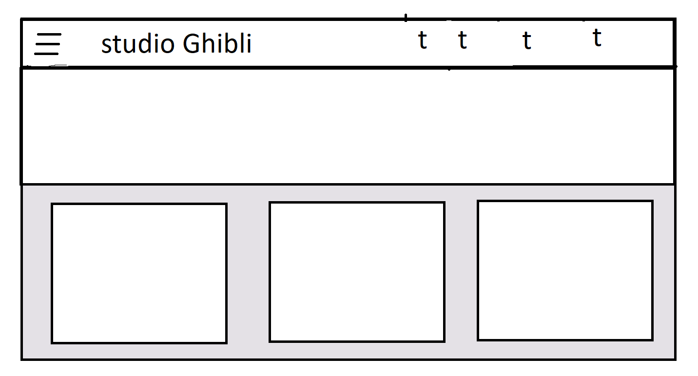
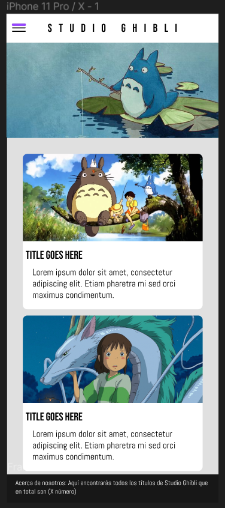
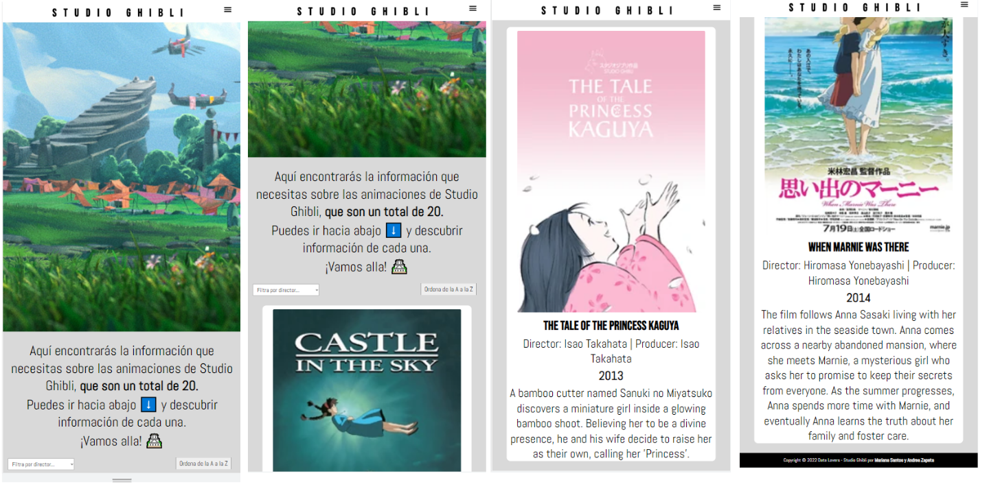
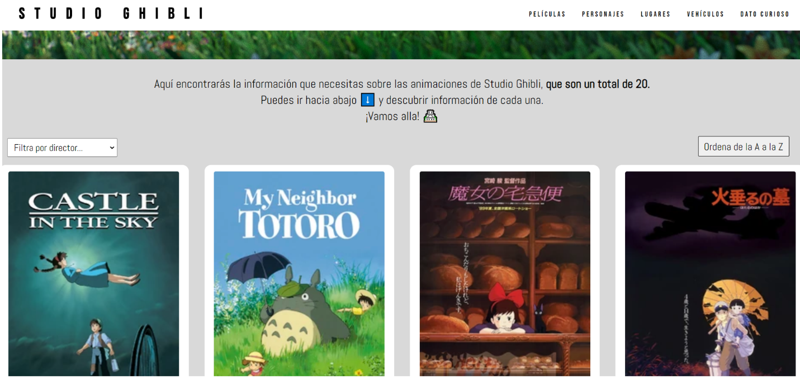

#  🏯 Data Lovers Project - Studio Ghibli 🏯📽️

## Índice

* [1. Definición del Producto](#1-Definición-del-producto)
* [2. Historias de usuario](#2-Historias-de-usuario)
* [3. Diseño de la interfaz de usuario](#3-Diseño-de-la-interfaz-de-usuario)
* [4. Testeos de usabilidad](#4-Testeos-de-usabilidad)
* [5. Referencias](#5-Referencias)

***

## 1. Definición del producto

Studio Ghibli es un estudio japonés de animación y es considerado como uno de los mejores estudios de animación del mundo. Nuestro producto es una interfaz que satisface las necesidades específicas de usuarias que desean **conocer más información sobre este estudio**, clasificando la misma en películas, personajes, ubicaciones y vehículos.

## 2. Historias de usuario

Tuvimos en cuenta la **información proporcionada en la investigación breve de las necesidades de nuestras usuarias**.

Establecimos los criterios de aceptación para cada historia, buscando una concordancia entre el producto y las necesidades, creando una plataforma responsive que, a partir de las siguientes historias de usuario:

**1.** Muestra cuántas y cuales son las animaciones de Studio Ghibli.
**2.** Permite **filtrar** las películas por director y conocer en una ficha técnica su poster, año de lanzamiento, productor, entre otros.
**3.** Cuenta con una sección de personajes que además de imágenes tiene información sobre su género, especie y edad.
**4.** **Muestra** información sobre las locaciones y los vehículos de las animaciones.
**5.** **Ordena** la información mostrada en cada categoría de la A a la Z.

## 3. Diseño de la interfaz de usuario

Para el desarrollo de nuestra interfaz procuramos sostener ambos prototipos y replicarlos en la plataforma, teniendo un producto muy similar al planteado.

#### Prototipo de baja fidelidad

Este primer prototipo muestra la estructura que tendría la página web en vista de escritorio.

#### Prototipo de alta fidelidad

A través de la herramienta figma, creamos un prototipo de alta fidelidad para móvil

## 4. Testeos de usabilidad

El diseño de la interfaz se fue refinando de acuerdo con el feedback recibido por nuestras compañeras y la interacción de otros usuarios con la página web. Recibimos feedback sobre la estética de la interfaz e hicimos ajustes en la imagen del banner principal, el menú de navegación y el despliegue de la data.

## 5. Producto final

- La interfaz tiene un diseño responsive que muestra un menú hamburguesa para dispositivos más pequeños.  

En el proceso de creación agregamos un filtro por director para las películas y un botón de ordenar de la A a la Z que sirve para cada una de las secciones de la página.

