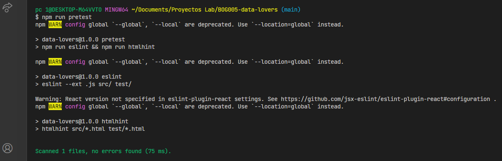
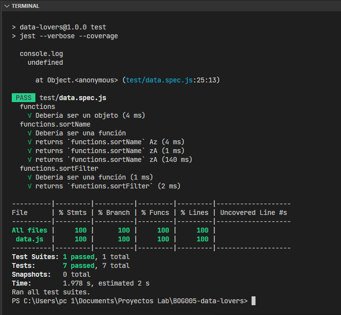
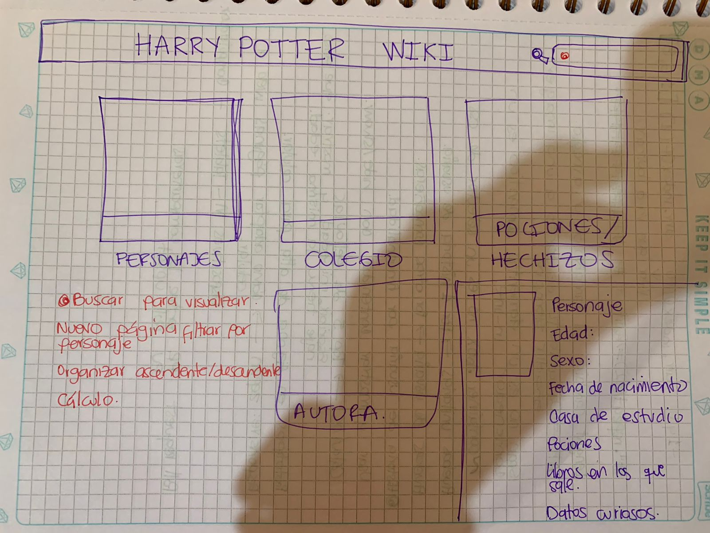
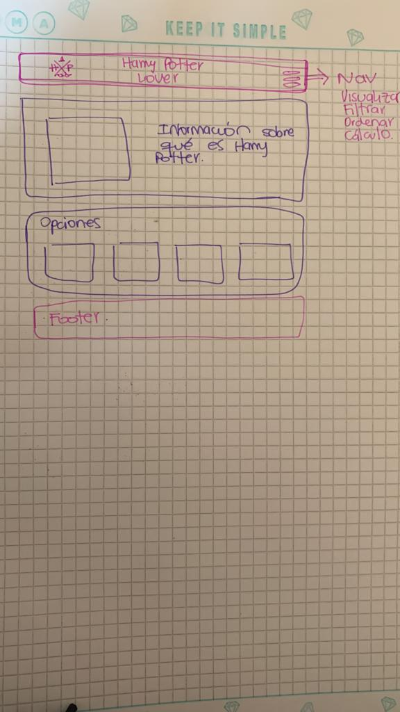

# Harry Potters Lovers Data

## Objetivos de aprendizaje

* [X] Usa VanillaJS.

* [X] Pasa linter (`npm run pretest`):

* [X] Pasa tests (`npm test`)

* [X] Pruebas unitarias cubren un mínimo del 70% de statements, functions y
  lines y branches: Sí.

* [X] Incluye _Definición del producto_ clara e informativa:
  Desarrollar una aplicación para dispositivos móviles y desktop en los cual los usuari@s pueden conocer
  información sobre los personajes de la saga de Harry Potter, datos curiosos, ordenando, filtrando y calculando
  datos importantes.

* [X] Incluye historias de usuario:
1. Historia de Usuario 1:
Yo, como visitante,

quiero visualizar los personajes
desde mi celular

para conocer los nombres y datos de los personajes.

2. Historia de Usuario 2:
Yo, como visitante,

quiero ordenar los personajes
por orden alfabético
desde mi celular

para conocer el orden de los mismos.

3. Historia de Usuario 3:
Yo, como visitante,

quiero filtrar los personajes
por casa de estudio
desde mi celular

para conocer quienes pertenecen a cada casa.

4. Historia de Usuario 4:
Yo, como visitante,

quiero calcular el % de personajes
por cada casa de Hogwarts
desde mi celular

para conocer el % de cada casa.

* [X] Incluye _sketch_ de la solución (prototipo de baja fidelidad):

* [X] Incluye _Diseño de la Interfaz de Usuario_ (prototipo de alta fidelidad):

* [X] Incluye link a Figma: [anchor](https://www.figma.com/file/cSDHRljUZmtPmyyOcHwvje/Data-lovers?node-id=2%3A4
 "Prototipo de alta fidelidad")

* [X] Incluye el listado de problemas que detectaste a través de tests de
  usabilidad:

  - Las funciones puras debían estar dentro de un objeto.
  - En la función de ordenar de la Za por defecto reconocía la función de la Az.
  - Para los argumentos vacíos se debía generar un error.

* [X] UI: Muestra lista y/o tabla con datos y/o indicadores.

* [X] UI: Permite ordenar data por uno o más campos (asc y desc).

* [X] UI: Permite filtrar data en base a una condición.

* [X] UI: Es _responsive_.
