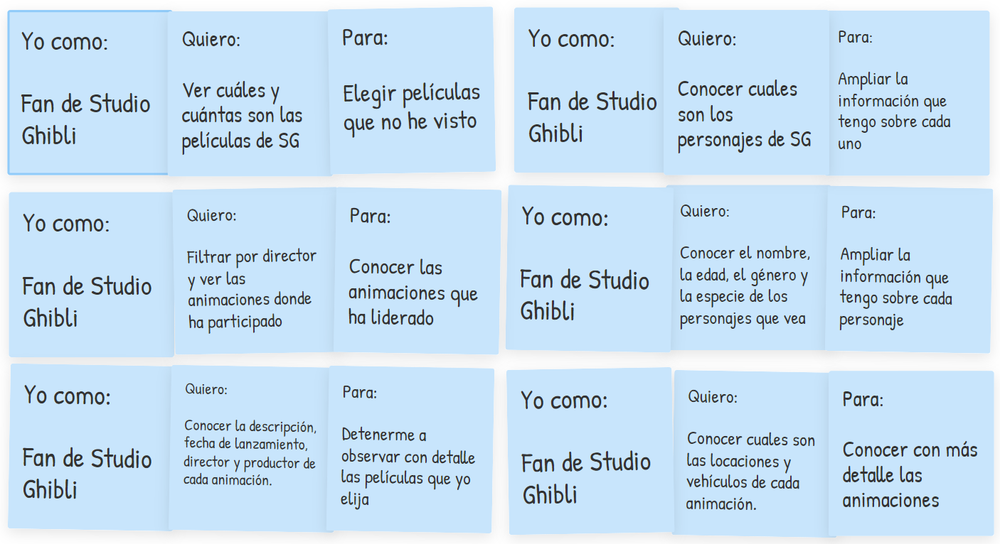

# Data Lovers - Studio Ghibli - Ghibli Match

## Índice

* [1. Definición del Producto](#1-Definición-del-producto)
* [2. Historias de usuario](#2-Historias-de-usuario)
* [3. Diseño de la interfaz de usuario](#3-Diseño-de-la-interfaz-de-usuario)
* [4. Testeos de usabilidad](#4-Testeos-de-usabilidad)
* [5. Referencias](#5-Referencias)

***

## 1. Definición del producto

Studio Ghibli es un estudio japonés de animación y es considerado como uno de los mejores estudios de animación del mundo. Nuestro producto es una interfaz que satisface las necesidades específicas de usuarias que desean **conocer más información sobre este estudio**, clasificando las películas, personajes, ubicaciones y vehículos.

## 2. Historias de usuario

Tuvimos en cuenta la información proporcionada en la investigación breve de las necesidades de nuestras usuarias.

Establecimos los criterios de aceptación para cada historia, buscando una concordancia entre el producto y las necesidades, creando una plataforma responsive que, a partir de las siguientes historias de usuario:

- Muestra cuántas y cuales son las animaciones de Studio Ghibli.
- Permite filtrar las películas por director y conocer en una ficha técnica su poster, año de lanzamiento, productor, entre otros.
- Cuenta con una sección de personajes que además de imágenes tiene información sobre su género, especie y edad.
- Muestra información sobre las locaciones y los vehículos de las animaciones.
- Ordena la información mostrada en cada categoría de la A a la Z.

## 3. Diseño de la interfaz de usuario

#### Prototipo de baja fidelidad

#### Prototipo de alta fidelidad

## 4. Testeos de usabilidad

## 5. Referencias
